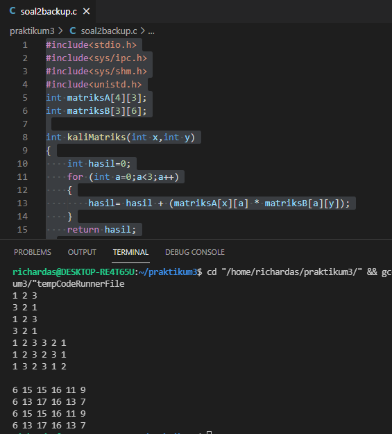

# soal-shift-sisop-modul-3-A06-2021

Jawaban soal praktikum Sistem Operasi modul 3.

**Anggota kelompok**:
```
- Richard Asmarakandi       05111940000017
- Muhammad Rafki Mardi      05111940000054
- Husin Muhammad Assegaff   05111940000127
```
---
## Tabel Konten
- [Soal 1](#soal-1)
  - [Soal Client](#soal-client)
  - [Soal Server](#soal-server)
  
- [soal-shift-sisop-modul-3-A06-2021](#soal-shift-sisop-modul-3-a06-2021)
  - [Tabel Konten](#tabel-konten)
  - [Soal 1](#soal-1)
    - [Soal Client](#soal-client)
    - [Soal Server](#soal-server)
  - [Soal 2](#soal-2)
    - [Soal 2.a](#soal-2a)
    - [Soal 2.b](#soal-2b)
    - [Soal 2.c](#soal-2c)
  - [Soal 3](#soal-3)

- [soal-shift-sisop-modul-3-A06-2021](#soal-shift-sisop-modul-3-a06-2021)
  - [Tabel Konten](#tabel-konten)
  - [Soal 1](#soal-1)
    - [Soal Client](#soal-client)
    - [Soal Server](#soal-server)
  - [Soal 2](#soal-2)
    - [Soal 2.a](#soal-2a)
    - [Soal 2.b](#soal-2b)
    - [Soal 2.c](#soal-2c)
  - [Soal 3](#soal-3)

## Soal 1
**[Source Code Soal 1 - Client](https://github.com/husinassegaff/soal-shift-sisop-modul-3-A06-2021/blob/main/soal1/Client/client.c)**<br />
**[Source Code Soal 1 - Server](https://github.com/husinassegaff/soal-shift-sisop-modul-3-A06-2021/blob/main/soal1/Server/server.c)**

**Deskripsi:**\
deskripsi.

### Soal Client

**Deskripsi:**\
deskripsi.

**Pembahasan:**
```c
//kode
```

- 
-
-

```
hasil
```

**Bukti   :**


**Kendala :**\
kendala.

### Soal Server
**Deskripsi:**\
deskripsi.

**Pembahasan:**

```c
//kode
```
- 
-
-

```
hasil
```
**Bukti   :**


**Kendala :**\
kendala.

---
## Soal 2 
**[Source Code Soal 2](https://github.com/husinassegaff/soal-shift-sisop-modul-2-A06-2021/blob/main/soal2)**

**Deskripsi:**\
Soal akan diperjelas pada tiap subsoal.

### Soal 2.a
**Deskripsi:**\
Membuat program perkalian matriks 4x3 dengan matriks 3x6, lalu menampilkan hasilnya

**Pembahasan:**
```c
#include<stdio.h>
#include<sys/ipc.h>
#include<sys/shm.h>
#include<unistd.h>
int matriksA[4][3];
int matriksB[3][6];

int kaliMatriks(int x,int y)
{
    int hasil=0;
    for (int a=0;a<3;a++)
    {
        hasil= hasil + (matriksA[x][a] * matriksB[a][y]);
    }
    return hasil;
}

int main ()
{
    int matriksC[4][6];
    for (int a=0;a<4;a++)
    {
        for (int b=0;b<3;b++)
        {
            scanf("%d",&matriksA[a][b]);
        }
    }
    for (int a=0;a<3;a++)
    {
        for (int b=0;b<6;b++)
        {
            scanf("%d",&matriksB[a][b]);
        }
    }
    for (int a=0;a<4;a++)
    {
        for (int b=0;b<6;b++)
        {
            matriksC[a][b] = kaliMatriks(a,b);
        }
    }
    printf("\n");
    for (int a=0;a<4;a++)
    {
        for (int b=0;b<6;b++)
        {
            printf("%d ",matriksC[a][b]);
        }
        printf("\n");
    }
}
```

- Kita buat 2 matriks global sebagai input dan 1 matriks local sebagai output dengan tipe data int
- Looping pertama dan kedua digunakan untuk menginput data matriks
- Looping ketiga digunakan untuk mengisi matriks hasil dengan hasil operasi perkalian dua matriks input.
- Operasi perkalian dibuat dalam fungsi baru bernama kaliMatriks(int x, int y) dengan parameter x sebagai baris dan y sebagai kolom.

```
Input :
1 2 3
3 2 1
1 2 3
3 2 1
1 2 3 3 2 1
1 2 3 2 3 1
1 3 2 3 1 2

Output :
6 15 15 16 11 9 
6 13 17 16 13 7 
6 15 15 16 11 9 
6 13 17 16 13 7 
```
**Bukti   :**



**Kendala :**\
Belum ditemukan kendala dalam mengerjakan soal ini

### Soal 2.b

**Deskripsi:**\
deskripsi.

**Pembahasan:**
```c
//kode
```

- 
-
-

```
hasil
```
**Bukti   :**


**Kendala :**
kendala.

### Soal 2.c

**Deskripsi:**\
deskripsi.

**Pembahasan:**
```c
//kode
```

- 
-
-

```
hasil
```

**Bukti :**


**Kendala :**\
Kendala.

---
## Soal 3 

**[Source Code Soal 3](https://https://github.com/husinassegaff/soal-shift-sisop-modul-2-A06-2021/blob/main/soal3/soal3.c)**


**Deskripsi:**\
Pada soal ini diminta untuk merapikan file dengan dikategorikan berdasarkan ekstensinya, yakni file dipindahkan ke folder yang memiliki nama sama dengan ekstensi file tersebut. Contohnya **file1.jpg** akan dipindah ke folder **jpg**

Adapun terdapat beberapa opsi,
1. -f
digunakan untuk menambahkan argumen file yang bisa dikategorikan sebanyak yang diinginkan pengguna.

Output yang dikeluarkan adalah,
```
<!-- jika berhasil --> Berhasil Dikategorikan
<!-- jika gagal --> Sad, gagal :(
```
2. -d
digunakan untuk mengkategorikan directory. Namun, user hanya bisa memasukkan input sebanyak satu directory saja

Output yang dikeluarkan adalah,
```
<!-- jika berhasil --> Direktori sukses disimpan!
<!-- jika gagal --> Yah, gagal disimpan :(
```
3. *
Opsi ini akan mengkategorikan seluruh file yang ada di working directory ketika menjalankan program C tersebut

Adapun pada file yang tidak memiliki ekstensi, maka file tersebut akan disimpan di folder **Unknown**. Begitu juga dengan file hidden, akan masuk ke folder **Hidden**


**Pembahasan:**
```c
#include<stdio.h>
#include<ctype.h>
#include<string.h>
#include<pthread.h>
#include<stdlib.h>
#include<unistd.h>
#include<dirent.h>
#include<sys/stat.h>
#include<sys/types.h>
#include<sys/wait.h>

pthread_t tid[1000000];
pid_t child;
char cwd[1000];
char folder[1000];
char deepfolder[1000];
char deepfolder2[1000];
int err;

void *move(void *arg) {
	char *filepath = (char *)arg;
	char *extension = NULL;
	extension = strchr(filepath, '.');
	char ext[1000];
	memset(ext, '\0', sizeof(ext));
	if((extension-filepath-strlen(cwd)+1)==2 || (extension-filepath+1)==1) strcpy(ext, "Hidden");
	else if(extension) {
		extension++;
        for(int i=0; i<strlen(extension); i++) {
               	ext[i] = tolower(extension[i]);
    	}
	}
	else strcpy(ext, "Unknown");
    char *filename = NULL;
    filename = strrchr(filepath, '/');
    if(filename) filename++;
	else filename = filepath;

	char folderpath[1000];
	strcpy(folderpath, cwd);
	strcat(folderpath, "/");
	strcat(folderpath, ext);
	mkdir(folderpath, S_IRWXU);
	if(strlen(deepfolder2)>1){
		char fullname[1000];
		strcpy(fullname, deepfolder2);
		strcat(fullname, "/");
		strcat(fullname, filename);
		strcat(folderpath, "/");
        strcat(folderpath, filename);
        rename(fullname, folderpath);
	}
	else if(strlen(folder) > 1) {
		char fullname[1000];
		strcpy(fullname, folder);
		strcat(fullname, "/");
		strcat(fullname, filename);
		strcat(folderpath, "/");
        strcat(folderpath, filename);
        rename(fullname, folderpath);
	}
	else {					
	    strcat(folderpath, "/");
        strcat(folderpath, filename);
		rename(filepath, folderpath);
	}
	return NULL;
}

void minf(int argc, char *argv[]){
  for(int i=2; i<argc; i++) {
		err = pthread_create(&tid[i], NULL, move, (void *)argv[i]);
		if(err != 0) printf("File %d : Sad, gagal :(\n", i-1);
        else printf("File %d : Berhasil Dikategorikan\n", i-1);
	}
	for(int j=2; j<argc; j++) pthread_join(tid[j], NULL);
    return;
}

void deep(){
	DIR *dir;
	struct dirent *tmp;
	int i=0;
	memset(deepfolder2, '\0', sizeof(deepfolder2));
	strcpy(deepfolder2,deepfolder);
	printf("%s\n", deepfolder2);
	dir = opendir(deepfolder2);
	while((dir!=NULL) && (tmp=readdir(dir))) {
		if(tmp->d_type==DT_DIR && strcmp(tmp->d_name, ".")!=0 && strcmp(tmp->d_name, "..")!=0){
			strcat(deepfolder2,tmp->d_name);
			strcat(deepfolder2,"/");
			deep();
		}
        if(strcmp(tmp->d_name, ".")==0 || strcmp(tmp->d_name, "..")==0 || strcmp(tmp->d_name, "soal3.c")==0 || strcmp(tmp->d_name, "soal3")==0 || tmp->d_type==DT_DIR) 
		continue;
        err = pthread_create(&tid[i], NULL, move, tmp->d_name);
        if(err != 0) printf("Yah, gagal disimpan :(\n");
        else printf("Direktori sukses disimpan!\n");
        i++;
    }
    for(int j=0; j<i; j++) pthread_join(tid[j], NULL);
    closedir(dir);
    return;
}

void other(int argc, char *argv[]){
  DIR *dir;
	struct dirent *tmp;
	int i=0;
	if(strcmp(argv[1], "-d") == 0) {
    	dir = opendir(argv[2]);
		strcpy(folder, argv[2]);
	}
	else if((argv[1][0]=='*') && (strlen(argv[1])==1)) {
		dir = opendir(cwd);
		strcpy(folder, cwd);
	}
	else {
		printf("Butuh Argumen -f atau -d atau \\*\n");
        return;
	}
	while((dir!=NULL) && (tmp=readdir(dir))) {
		if(tmp->d_type==DT_DIR && strcmp(tmp->d_name, ".")!=0 && strcmp(tmp->d_name, "..")!=0){
			strcpy(deepfolder,folder);
			strcat(deepfolder,"/");
			strcat(deepfolder,tmp->d_name);
			strcat(deepfolder,"/");
			deep();
		}
        if(strcmp(tmp->d_name, ".")==0 || strcmp(tmp->d_name, "..")==0 || strcmp(tmp->d_name, "soal3.c")==0 || strcmp(tmp->d_name, "soal3")==0 || tmp->d_type==DT_DIR) 
		continue;
        err = pthread_create(&tid[i], NULL, move, tmp->d_name);
        if(err != 0) printf("Yah, gagal disimpan :(\n");
        else printf("Direktori sukses disimpan!\n");
        i++;
    }
    for(int j=0; j<i; j++) pthread_join(tid[j], NULL);
    closedir(dir);
    return;
}

int main(int argc, char *argv[]) {
	getcwd(cwd, sizeof(cwd));
	memset(folder, '\0', sizeof(folder));
	memset(deepfolder, '\0', sizeof(deepfolder));
	memset(deepfolder2, '\0', sizeof(deepfolder2));
	if(argc < 2) {
		printf("Butuh Argumen -f atau -d atau \\*\n");
		return 0;
	}
	if(strcmp(argv[1], "-f") == 0) {
		minf(argc,argv);
	}
	else {
		other(argc,argv);
	}
	return 0;
}
```

- Untuk opsi **-f** dapat diselesaikan dengan membuat thread pada tiap file yang ingin dikategorikan serta melakukan thread join agar bisa berjalan secara bersamaan. Berikut kode yang menjalankan hal tersebut

```
for(int i=2; i<argc; i++) {
  err = pthread_create(&tid[i], NULL, move, (void *)argv[i]);
  if(err != 0) printf("File %d : Sad, gagal :(\n", i-1);
  else printf("File %d : Berhasil Dikategorikan\n", i-1);
}
for(int j=2; j<argc; j++) pthread_join(tid[j], NULL);
``` 
- Adapun untuk opsi **-d** dan * pada dasarnya cara kerjanya sama, hanya saja berbeda pada directory yang dibuka. Untuk **-d** membuka directory yang disebutkan di argument. Maka digunakan kode sebagai berikut untuk menunjuk directory tersebut,
```
if(strcmp(argv[1], "-d") == 0) {
  dir = opendir(argv[2]);
  strcpy(folder, argv[2]);
}
```
- Sedangkan pada opsi * yang ditunjuk adalah directory saat ini. berikut kode yang menjalankan perintah tersebut,
```
else if((argv[1][0]=='*') && (strlen(argv[1])==1)) {
  dir = opendir(cwd);
  strcpy(folder, cwd);
}
```
- Kemudian, setiap file yang berada di directory yang ditunjuk opsi **-d** ataupun directory saat ini jika menggunakan * akan diperiksa satu per satu. Apabila yang diperiksa benar merupakan file, maka akan dibuat thread baru untuk kategorisasi file tersebut ke dalam folder dan juga menggunakan thread join supaya dapat berjalan secara bersamaan. Berikut bagian implementasi kodenya,
```
while((dir!=NULL) && (tmp=readdir(dir))) {
  if(tmp->d_type==DT_DIR && strcmp(tmp->d_name, ".")!=0 && strcmp(tmp->d_name, "..")!=0){
    strcpy(deepfolder,folder);
    strcat(deepfolder,"/");
    strcat(deepfolder,tmp->d_name);
    strcat(deepfolder,"/");
    deep();
  }

  if(strcmp(tmp->d_name, ".")==0 || strcmp(tmp->d_name, "..")==0 || strcmp(tmp->d_name, "soal3.c")==0 || strcmp(tmp->d_name, "soal3")==0 || tmp->d_type==DT_DIR) continue;

  err = pthread_create(&tid[i], NULL, move, tmp->d_name);

  if(err != 0) printf("Yah, gagal disimpan :(\n");
  else printf("Direktori sukses disimpan!\n");
  i++;
}
for(int j=0; j<i; j++) pthread_join(tid[j], NULL);
closedir(dir);
```

- Adapun untuk memindahkan file dan dikategorikan perlu diambil ekstensi pada file tersebut sebagai penamaan folder dengan menggunakan `strchr` berupa pemisah "."
- Apabila ektensi file tidak ada, maka file tersebut akan dimasukkan ke folder **Unknown**
- Adapun implementasi kodenya berupa mengubah nama filenya untuk dipindahkan


```
void *move(void *arg) {
	char *filepath = (char *)arg;
	char *extension = NULL;
	extension = strchr(filepath, '.');
	char ext[1000];
	memset(ext, '\0', sizeof(ext));
	if((extension-filepath-strlen(cwd)+1)==2 || (extension-filepath+1)==1) strcpy(ext, "Hidden");
	else if(extension) {
		extension++;
        for(int i=0; i<strlen(extension); i++) {
               	ext[i] = tolower(extension[i]);
    	}
	}
	else strcpy(ext, "Unknown");
    char *filename = NULL;
    filename = strrchr(filepath, '/');
    if(filename) filename++;
	else filename = filepath;

	char folderpath[1000];
	strcpy(folderpath, cwd);
	strcat(folderpath, "/");
	strcat(folderpath, ext);
	mkdir(folderpath, S_IRWXU);
	if(strlen(deepfolder2)>1){
		char fullname[1000];
		strcpy(fullname, deepfolder2);
		strcat(fullname, "/");
		strcat(fullname, filename);
		strcat(folderpath, "/");
        strcat(folderpath, filename);
        rename(fullname, folderpath);
	}
	else if(strlen(folder) > 1) {
		char fullname[1000];
		strcpy(fullname, folder);
		strcat(fullname, "/");
		strcat(fullname, filename);
		strcat(folderpath, "/");
        strcat(folderpath, filename);
        rename(fullname, folderpath);
	}
	else {					
	    strcat(folderpath, "/");
        strcat(folderpath, filename);
		rename(filepath, folderpath);
	}
	return NULL;
}
```

**Bukti :**
- Bukti penerapan opsi **-f**
  - Mengkategorikan file **Archive.zip**
.PNG)
  - Hasil kategori
.PNG)

- Bukti penggunaan opsi **-d**
  - Mengkatogerikan file ekstensi JPG yang berada di directory **/home/husin/kategorijpg**
.PNG)
  - Hasilnya berupa empat folder dengan nama file masing-masing
.PNG)

- Bukti penggunaan opsi *
  - Mengkategorikan file yang berada di directory **/home/husin/soal3**
.PNG)
  - Hasil kategori
  ```
  Direktori sukses disimpan!
  Direktori sukses disimpan!
  Direktori sukses disimpan!
  Direktori sukses disimpan!
  Direktori sukses disimpan!
  Direktori sukses disimpan!
  Direktori sukses disimpan!
  Direktori sukses disimpan!
  Direktori sukses disimpan!
  Direktori sukses disimpan!
  Direktori sukses disimpan!
  Direktori sukses disimpan!
  Direktori sukses disimpan!
  Direktori sukses disimpan!
  Direktori sukses disimpan!
  /home/husin/soal3/hasduhasudha.jpg/
  Direktori sukses disimpan!
  Direktori sukses disimpan!
  Direktori sukses disimpan!
  Direktori sukses disimpan!
  Direktori sukses disimpan!
  /home/husin/soal3/adjaisd/
  Direktori sukses disimpan!
  /home/husin/soal3/sdauh kasdks.ZIP/
  Direktori sukses disimpan!
  Direktori sukses disimpan!
  Direktori sukses disimpan!
  Direktori sukses disimpan!
  Direktori sukses disimpan!
  Direktori sukses disimpan!
  Direktori sukses disimpan!
  Direktori sukses disimpan!
  Direktori sukses disimpan!
  Direktori sukses disimpan!
  Direktori sukses disimpan!
  Direktori sukses disimpan!
  Direktori sukses disimpan!
  Direktori sukses disimpan!
  Direktori sukses disimpan!
  Direktori sukses disimpan!
  Direktori sukses disimpan!
  /home/husin/soal3/folderku/
  Direktori sukses disimpan!
  Direktori sukses disimpan!
  Direktori sukses disimpan!
  Direktori sukses disimpan!
  /home/husin/soal3/ashduashd.txt/
  Direktori sukses disimpan!
  Direktori sukses disimpan!
  Direktori sukses disimpan!
  Direktori sukses disimpan!
  Segmentation fault
  ```
  .PNG)

**Kendala :**\
Pada pengkategorian file masih terdapat kesalahan dalam penamaan folder dan rekursifnya yang belum berjalan dengan sempurna